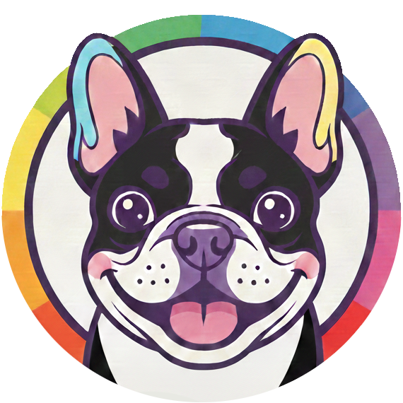

# Bulldogent

**Agentic AI bot that lives in your team chat and gets things done.**

Bulldogent is a multi-platform AI assistant that responds to @mentions across Slack, Discord, Teams, and Telegram. It connects to your team's knowledge sources — Jira, Confluence, GitHub, and the web — through an agentic tool-calling loop where the LLM decides what to search and when. Sensitive operations like creating issues or merging PRs go through a configurable approval workflow before execution.

## Features

- **Multi-platform** — Slack, Discord, Microsoft Teams, Telegram
- **Provider-agnostic LLM** — OpenAI, AWS Bedrock (Claude), Google Vertex AI (Gemini)
- **Agentic tool calling** — LLM autonomously decides which tools to use across multiple reasoning steps
- **Knowledge sources** — Jira, Confluence, GitHub, web search (Tavily)
- **Approval gates** — configurable per-operation and per-project approval groups
- **Thread-aware** — maintains conversation context across message threads

## Architecture

```
                        @mention
                           |
                    +--------------+
                    |     Bot      |      Agentic loop (max 15 steps)
                    |  orchestrator|----+
                    +--------------+    |
                           |            |
              +------------+------------+------------+
              |            |            |            |
        +-----------+ +---------+ +---------+ +-----------+
        | Messaging | |   LLM   | |  Tools  | | Approval  |
        | Platforms | |Providers| |Registry | | Manager   |
        +-----------+ +---------+ +---------+ +-----------+
        | Slack     | | OpenAI  | | Jira    | | Per-op    |
        | Discord   | | Bedrock | | GitHub  | | Per-proj  |
        | Teams     | | Vertex  | | Conflu. | | Reaction  |
        | Telegram  | |         | | Web     | | based     |
        +-----------+ +---------+ +---------+ +-----------+
```

The bot follows a clean, layered design with Protocol-based abstractions. Each layer (messaging, LLM, tools) is independently extensible — add a new platform, provider, or tool by implementing the abstract interface and registering it.

## Tools

| Tool | Library | Operations |
|------|---------|------------|
| **Jira** | `atlassian-python-api` | search issues (structured filters + JQL), get issue, list issue types, create, update (with status transitions), delete |
| **Confluence** | `atlassian-python-api` | search pages (CQL), get page content, get child pages, list spaces |
| **GitHub** | `PyGithub` | issues (list, create), PRs (list, get, files, merge), comments, releases (list, get, publish), workflows (list, runs, jobs) |
| **Web Search** | `tavily-python` | real-time web search with AI summaries |

Tools are YAML-driven — each adapter has an `operations.yaml` that defines parameters and descriptions. The LLM sees these as callable functions.

## Quick Start

### Prerequisites

- Python 3.12+
- [uv](https://docs.astral.sh/uv/) package manager

### Install

```bash
git clone <repo-url> && cd bulldogent
make install
```

### Configure

```bash
cp .env.example .env
cp config/tools.yaml.example config/tools.yaml
cp config/tool_operation_approval.yaml.example config/tool_operation_approval.yaml
```

Edit `.env` with your credentials. You only need to configure the platforms and providers you want to use — unconfigured ones are silently skipped.

**Minimum viable setup** (Slack + OpenAI):
```env
PLATFORM_SLACK_LLM_PROVIDER=openai
PLATFORM_SLACK_BOT_TOKEN=xoxb-...
PLATFORM_SLACK_APP_TOKEN=xapp-...
PROVIDER_OPENAI_API_KEY=sk-...
PROVIDER_OPENAI_MODEL=gpt-4o
```

### Run

```bash
make run
```

## Configuration

All configuration follows the same pattern: YAML files define structure and env var names, `.env` provides the actual secrets. Only configure what you need — unconfigured platforms, providers, and tools are silently skipped.

### Environment Variables (`.env`)

All secrets and runtime values live here. Copy `.env.example` to `.env` and fill in only what you need.

**Platforms** — one block per chat service, set the provider and credentials:

| Variable | Description |
|----------|-------------|
| `PLATFORM_SLACK_LLM_PROVIDER` | Provider name: `openai`, `bedrock`, or `vertex` |
| `PLATFORM_SLACK_BOT_TOKEN` | Slack bot token (`xoxb-...`) |
| `PLATFORM_SLACK_APP_TOKEN` | Slack app-level token (`xapp-...`) |
| `PLATFORM_TEAMS_LLM_PROVIDER` | Provider for Teams |
| `PLATFORM_TEAMS_APP_ID` | Teams bot app ID |
| `PLATFORM_TEAMS_APP_PASSWORD` | Teams bot app password |
| `PLATFORM_DISCORD_LLM_PROVIDER` | Provider for Discord |
| `PLATFORM_DISCORD_BOT_TOKEN` | Discord bot token |
| `PLATFORM_TELEGRAM_LLM_PROVIDER` | Provider for Telegram |
| `PLATFORM_TELEGRAM_BOT_TOKEN` | Telegram bot token |

**LLM Providers** — each provider has model, temperature, max tokens, and provider-specific fields:

| Variable | Description |
|----------|-------------|
| `PROVIDER_OPENAI_MODEL` | Model name (e.g. `gpt-4o`) |
| `PROVIDER_OPENAI_API_KEY` | OpenAI API key |
| `PROVIDER_OPENAI_TEMPERATURE` | Sampling temperature (e.g. `0.7`) |
| `PROVIDER_OPENAI_MAX_TOKENS` | Max response tokens (default `2000`) |
| `PROVIDER_OPENAI_API_URL` | Optional custom endpoint (LiteLLM, Ollama, etc.) |
| `PROVIDER_BEDROCK_MODEL` | e.g. `anthropic.claude-3-5-sonnet-20241022-v2:0` |
| `PROVIDER_BEDROCK_REGION` | AWS region (e.g. `us-east-1`) |
| `PROVIDER_BEDROCK_ANTHROPIC_VERSION` | API version (e.g. `bedrock-2023-05-31`) |
| `PROVIDER_VERTEX_MODEL` | e.g. `gemini-1.5-pro` |
| `PROVIDER_VERTEX_PROJECT_ID` | GCP project ID |
| `PROVIDER_VERTEX_LOCATION` | GCP region (e.g. `us-central1`) |

**Tools** — credentials for each knowledge source:

| Variable | Description |
|----------|-------------|
| `TOOL_JIRA_URL` | Jira instance URL (e.g. `https://your-domain.atlassian.net`) |
| `TOOL_JIRA_USERNAME` | Jira username / email |
| `TOOL_JIRA_API_TOKEN` | Jira API token |
| `TOOL_CONFLUENCE_URL` | Confluence instance URL |
| `TOOL_CONFLUENCE_USERNAME` | Confluence username / email |
| `TOOL_CONFLUENCE_API_TOKEN` | Confluence API token |
| `TOOL_GITHUB_TOKEN` | GitHub personal access token |
| `TOOL_TAVILY_API_KEY` | Tavily web search API key |

### Platforms (`config/messaging_platform.yaml`)

Each platform block ties together a chat service, its credentials, and the LLM provider it should use.

```yaml
slack:
  llm_provider_env: PLATFORM_SLACK_LLM_PROVIDER   # which provider: openai, bedrock, or vertex
  bot_token_env: PLATFORM_SLACK_BOT_TOKEN
  app_token_env: PLATFORM_SLACK_APP_TOKEN
  reaction_acknowledged: bone        # emoji when message is received
  reaction_handled: dog              # emoji when response is sent
  reaction_error: x                  # emoji on failure
  reaction_approval: white_check_mark
  approval_groups:                   # groups referenced in approval rules
    project-leads: [U0AGBLF5MJ6]    # Slack user IDs
    jira_admins: [U0AGBLF5MJ6, U01234ABCDE]
```

Each platform can use a different LLM provider. The `approval_groups` map group names to platform-specific user IDs — these are referenced by the approval rules (see below).

### LLM Providers (`config/llm_provider.yaml`)

Keep only the providers you use. Each one reads its settings from env vars:

```yaml
openai:
  model_env: PROVIDER_OPENAI_MODEL              # e.g. gpt-4o
  temperature_env: PROVIDER_OPENAI_TEMPERATURE   # e.g. 0.7
  max_tokens_env: PROVIDER_OPENAI_MAX_TOKENS     # e.g. 2000
  api_key_env: PROVIDER_OPENAI_API_KEY
  api_url_env: PROVIDER_OPENAI_API_URL           # optional — LiteLLM proxy, Ollama, etc.

bedrock:
  model_env: PROVIDER_BEDROCK_MODEL              # e.g. anthropic.claude-3-5-sonnet-20241022-v2:0
  temperature_env: PROVIDER_BEDROCK_TEMPERATURE
  max_tokens_env: PROVIDER_BEDROCK_MAX_TOKENS
  region_env: PROVIDER_BEDROCK_REGION
  anthropic_version_env: PROVIDER_BEDROCK_ANTHROPIC_VERSION
  api_url_env: PROVIDER_BEDROCK_API_URL          # optional — LocalStack endpoint

vertex:
  model_env: PROVIDER_VERTEX_MODEL               # e.g. gemini-1.5-pro
  temperature_env: PROVIDER_VERTEX_TEMPERATURE
  max_tokens_env: PROVIDER_VERTEX_MAX_TOKENS
  project_id_env: PROVIDER_VERTEX_PROJECT_ID
  location_env: PROVIDER_VERTEX_LOCATION
  api_url_env: PROVIDER_VERTEX_API_URL           # optional — custom endpoint
```

The optional `api_url_env` lets you point any provider at a custom endpoint — useful for LiteLLM proxies, Ollama, LocalStack, or any OpenAI-compatible server.

### Tools (`config/tools.yaml`)

Each tool block defines connection credentials (via env var names) and metadata that the LLM sees in its system prompt — project names, descriptions, and aliases help the bot pick the right target without asking the user.

```yaml
jira:
  url_env: TOOL_JIRA_URL
  username_env: TOOL_JIRA_USERNAME
  api_token_env: TOOL_JIRA_API_TOKEN
  cloud: true
  projects:
    - prefix: ALPHA
      name: Project Alpha
      description: "Core product backend"    # shown to LLM for context
      aliases: [backend, api]                # alternative names users might use
    - prefix: BETA
      name: Project Beta
      description: "Core product frontend"
      aliases: [frontend, ui]

confluence:
  url_env: TOOL_CONFLUENCE_URL
  username_env: TOOL_CONFLUENCE_USERNAME
  api_token_env: TOOL_CONFLUENCE_API_TOKEN
  cloud: true
  spaces:
    - key: DEV
      name: Development
      description: "Engineering docs, ADRs, runbooks"
    - key: OPS
      name: Operations
      description: "Infrastructure and deployment guides"

github:
  token_env: TOOL_GITHUB_TOKEN
  default_org: acme                          # short names resolve to acme/<repo>
  repositories:
    - name: alpha
      description: "Backend API service"
    - name: beta
      description: "Frontend React app"

web_search:
  api_key_env: TOOL_TAVILY_API_KEY
  default_max_results: 5
  default_search_depth: basic                # basic or advanced
```

Only tools present in `tools.yaml` with valid credentials are registered. Remove a block entirely to disable that tool.

### Approval Rules (`config/tool_operation_approval.yaml`)

Controls which operations require human approval before execution. Two-level hierarchy — per-operation defaults and per-project/repository overrides:

```yaml
jira:
  jira_delete_issue:
    approval_group: jira_admins             # all deletes need admin approval

  jira_create_issue:
    approval_group: jira_admins             # default for all projects
    projects:
      ALPHA: alpha_maintainers              # override for ALPHA project
      BETA: ~                               # BETA is exempt (no approval needed)

github:
  github_merge_pr:
    approval_group: github_admins           # all merges need approval

  github_create_issue:
    approval_group: github_admins           # default for all repos
    projects:
      acme/alpha: backend_maintainers       # override for alpha repo
      acme/beta: ~                          # beta repo is exempt

  github_publish_release:
    projects:
      acme/alpha: release_managers          # only alpha releases need approval
```

Resolution order (most specific wins):
1. Project/repository override (`projects.<KEY>`)
2. Operation default (`approval_group`)
3. Not listed = no approval required

When approval is required, the bot posts a message in the thread mentioning the group members. They approve by reacting with the configured emoji (e.g. `:white_check_mark:`). If no one approves within the timeout, the operation is cancelled.

Group names here (e.g. `jira_admins`, `release_managers`) must match keys in the platform's `approval_groups` map, which defines the actual user IDs.

## Development

```bash
make lint         # ruff check
make format       # ruff format
make typecheck    # mypy (strict mode)
make test         # pytest with coverage
make check        # all of the above
make fix          # auto-fix lint issues + format
make clean        # remove cache files
```

